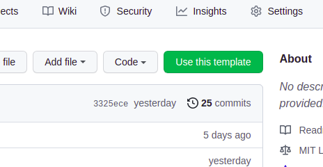
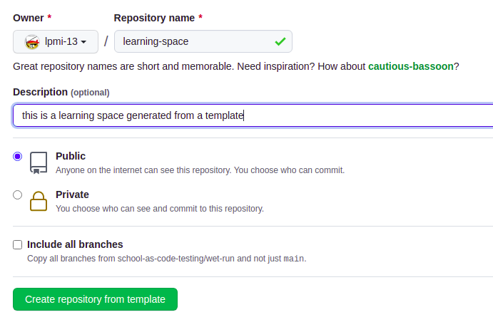
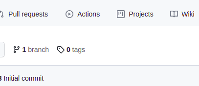
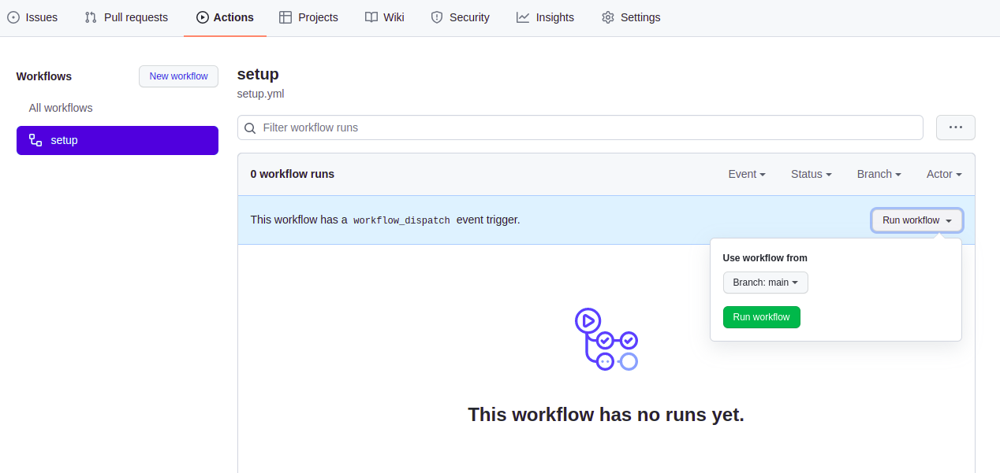
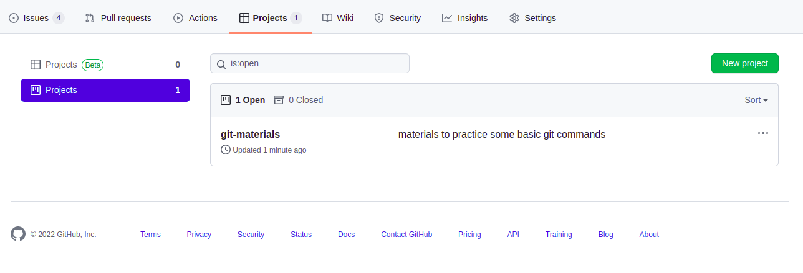
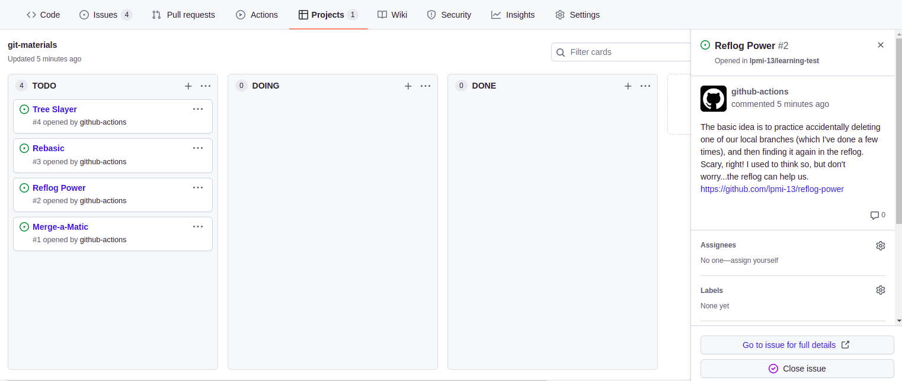

# Setup Instructions

This is a seed template to set up a learning space for a single user. It's currently set up to use an example configuratin for 4 micromaterials using git, but you could easily update it to point to any other materials you want.

This particular set up demonstrates a very simple (and short in terms of time committment) learning space, but it could easily be extended for much more in-depth study of various things.

All you need to do is use this template to generate your own repository, and the github action will do all the work of setting up the project board to track your learning journey!

## Getting Started

1. Click the "Use Template" button on the upper right hand corner of this page.

   

2. You can name the repository whatever you want

   

3. After your new repository is done being created, you'll be redirected to it.

4. To generate your learning path, go to the "Actions" tab and click on "I understand my workflows, go ahead and enable them".

   

5. In the Workflows section, select "setup", and press the "Run workflow" button, selecting the "main" branch to run the action

   

6. You can see this new Project board by clicking on Projects, and then selecting the one that's got a "1" next to it (ie, not the Beta Projects that is currently also shown by default).

   

7. The GitHub action will run and set up your project board, so you can view it to decide what to study first! You can click on the individual cards to see the full description. Once you select the first activity, move the card to DOING column. When you're all finished, move it to DONE. When everything is in DONE, you've completed the learning space.

   
